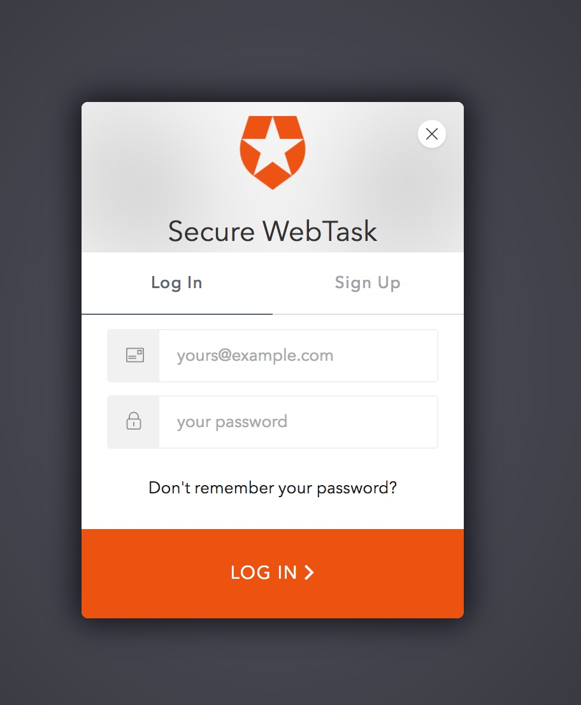

# What is it?

Provides an example on how you could use webtasks with a secured (Lock authentication required) login page,
and subsequently use a JWT Access Token for secured access to endpoints.

This quick sample could be reused for many different tasks like participating (registering) for a competition by signing in etc - Free T-Shirt to all registered users etc.

## Set up a Client and Resource Server in Auth0 Dashboard

You need a SPA Client and a Resource Server with `create:account` scope

## Running locally

To run the sample webtask locally:

Rename `.env.sample` as `.env` and add the required values for each key value pair.

```bash
$ npm install
$ npm start
```

Then go to `http://localhost:3000/`


## Deploying as Webtask 

Rename `.env.sample` as `.env` and add the required values for each key value pair.

```bash
$ ./deploy 
```

Then go to your webtask URL endpoint + `/secure-webtask/`


## How does it look?

Please note you can use Styling to change the look and feel to your needs. This is just pretty much the simplest thing that works.

Landing Page Step 1


Login Step 2



Home step 3


Finally, if you visit your webtask URL endpoint + `/secure-webtask/_list` you can see a list of emails for everyone
that has logged in.

Home step 4


## What is Auth0?

Auth0 helps you to:

* Add authentication with [multiple authentication sources](https://docs.auth0.com/identityproviders), either social like **Google, Facebook, Microsoft Account, LinkedIn, GitHub, Twitter, Box, Salesforce, amont others**, or enterprise identity systems like **Windows Azure AD, Google Apps, Active Directory, ADFS or any SAML Identity Provider**.
* Add authentication through more traditional **[username/password databases](https://docs.auth0.com/mysql-connection-tutorial)**.
* Add support for **[linking different user accounts](https://docs.auth0.com/link-accounts)** with the same user.
* Support for generating signed [Json Web Tokens](https://docs.auth0.com/jwt) to call your APIs and **flow the user identity** securely.
* Analytics of how, when and where users are logging in.
* Pull data from other sources and add it to the user profile, through [JavaScript rules](https://docs.auth0.com/rules).

## Create a free Auth0 Account

1. Go to [Auth0](https://auth0.com/signup) and click Sign Up.
2. Use Google, GitHub or Microsoft Account to login.

## Issue Reporting

If you have found a bug or if you have a feature request, please report them at this repository issues section. Please do not report security vulnerabilities on the public GitHub issue tracker. The [Responsible Disclosure Program](https://auth0.com/whitehat) details the procedure for disclosing security issues.

## Author

[Auth0](auth0.com)

## License

This project is licensed under the MIT license. See the [LICENSE](LICENSE) file for more info.
